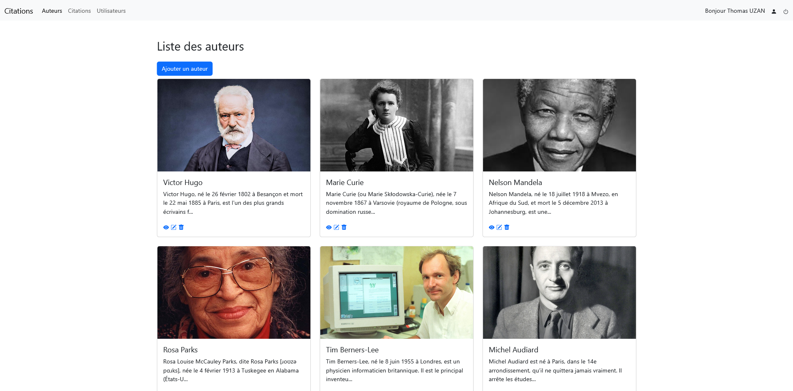
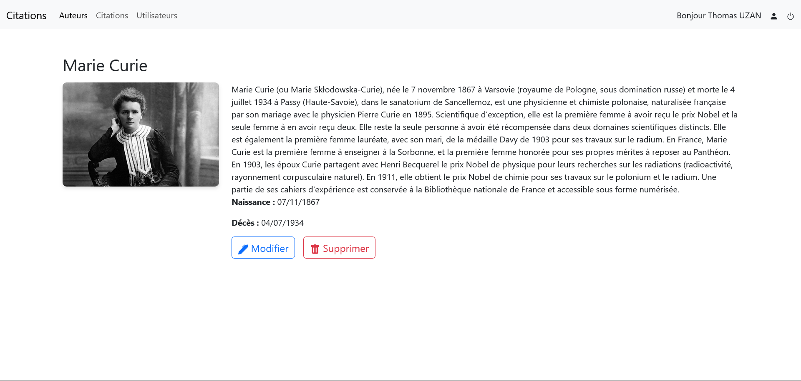
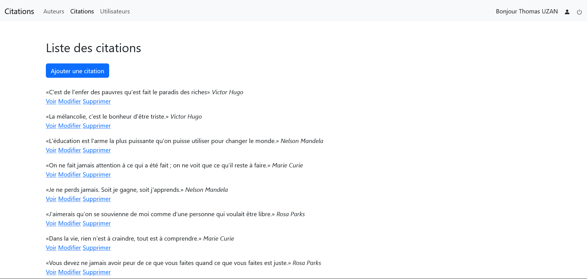
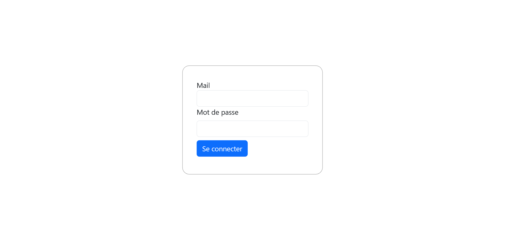
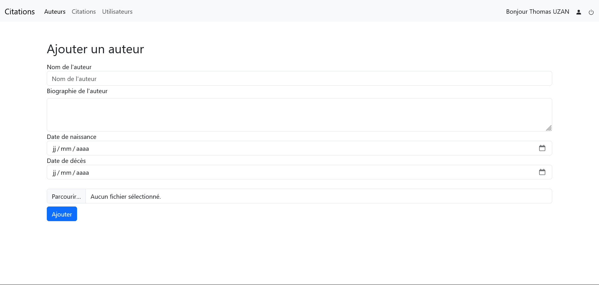
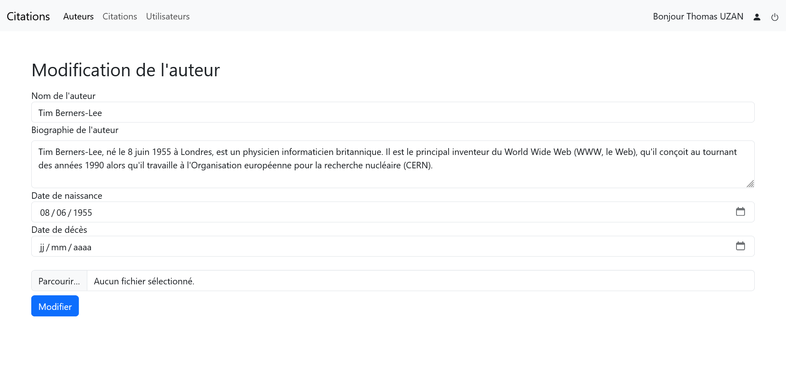

# Citations - Application PHP MVC

Application web de gestion de citations et d'auteurs développée en PHP avec une architecture MVC.

## 🌐 Démo en ligne

👉 **[Voir l'application](https://www.citations.thomasuzan.fr/)**

## Fonctionnalités

- 📖 **Consultation publique** : Les visiteurs peuvent parcourir les auteurs et leurs citations
- 🔐 **Espace administrateur** : Connexion requise pour ajouter, modifier ou supprimer du contenu
- 👤 **Gestion des auteurs** : CRUD complet (Create, Read, Update, Delete)
- 💬 **Gestion des citations** : CRUD complet avec attribution à un auteur
- 👥 **Gestion des utilisateurs** : Administration des comptes utilisateurs
- 📱 **Responsive** : Interface adaptée mobile, tablette et desktop

## Technologies utilisées

- **PHP 8** - Langage backend
- **MySQL / MariaDB** - Base de données
- **Bootstrap 5** - Framework CSS
- **TinyMCE** - Éditeur de texte riche
- **Architecture MVC** - Séparation des responsabilités

## Captures d'écran

### Liste des auteurs


### Détail d'un auteur


### Liste des citations


### Page de connexion


### Ajouter un auteur


### Modifier un auteur


## Installation en local

1. Cloner le repository
```bash
git clone https://github.com/VOTRE_USERNAME/citations.git
```

2. Importer la base de données
```bash
mysql -u root -p < quotes.sql
```

3. Configurer la connexion BDD
   - Copier `model/pdo.example.php` vers `model/pdo.php`
   - Renseigner vos identifiants de base de données

4. Accéder au projet via votre serveur local (WAMP, XAMPP, etc.)
```
http://localhost/citations/
```

## Structure du projet

```
citations/
├── index.php              # Front Controller (point d'entrée)
├── controller/            # Contrôleurs
│   ├── authors/
│   ├── quotes/
│   ├── users/
│   ├── profile/
│   └── authentification/
├── model/                 # Modèles (accès BDD)
│   ├── pdo.php
│   ├── authors.model.php
│   ├── quotes.model.php
│   └── users.model.php
├── view/                  # Vues
│   ├── layout.view.php
│   └── template/
│       ├── authors/
│       ├── quotes/
│       ├── users/
│       └── profile/
└── public/                # Fichiers publics (images, CSS, JS)
```

## Auteur

Développé par **Thomas UZAN** dans le cadre d'une formation DWWM.

- 🌐 Portfolio : [thomasuzan.fr](https://thomasuzan.fr)
- 💼 LinkedIn : [linkedin.com/in/thomas-uzan](https://www.linkedin.com/in/thomas-uzan/)